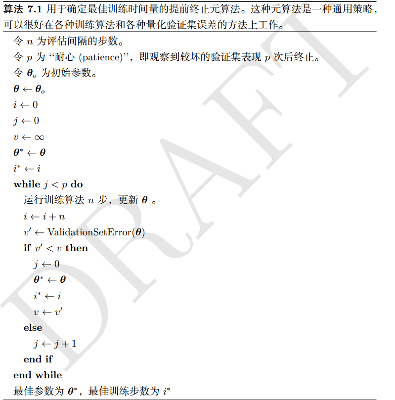
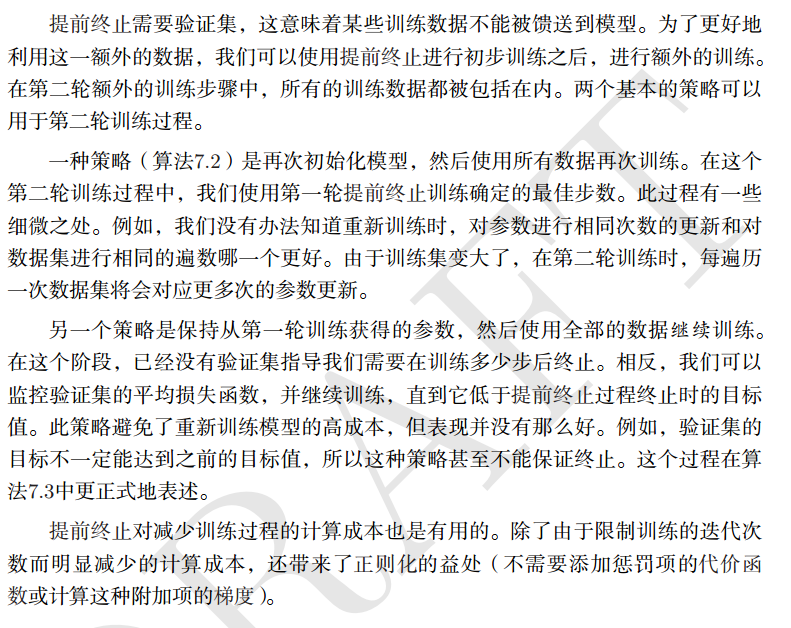

* 优化和正则太难了，第一次迭代以失败告终，能量密度在下降，不能再耗损，只是有了一定的了解。

# Regularization 

## what

* 防止过拟合
* 减少泛化误差，而不是训练误差；

## how
* [code](readme/Regularization.html)

### 1. 参数范数惩罚

* 正则项变大，然后w就会变小，激活函数如果是sigmoid就是趋向于中间，那么是个线性神经元，你的网络将只能学习到线性函数。
* 参数范数 Ω 的不同选择会导致不同的优先解。
* 我们只约束w，因为w表示两个变量的相互作用关系，而每个偏置仅控制一个单变量。

#### 1.1 L2正则化

* 这里学习率更新的部分没变， 每次更新前对权值进行了衰减。
* l2约束

* 约束之后的目标函数

* 约束对每个权值的影响

* 对于目标函数不敏感的轴会随着训练慢慢衰减掉。
* 线性回归中L2正则化

* L2 正则化不会导致参数变得稀疏。

#### 1.2 L1参数正则化

* L1 正则的过程

* 相比 L2正则化， L1正则化会产生更稀疏的解。此处稀疏性指的是一些参数具有 0 的最优值。
 L1正则化的稀疏性是相比 L2正则化是质的不同。

### 2. 作为约束的范数惩罚

* 我们可以把参数惩罚看作对权重强加的约束。如果Ω是L2范数，那么权重就是被约束在一个L2球中，
如果Ω是L1范数，那么权重就是被约束在一个L1范数限制的区域中。
* 使用显式约束和重投影的优点

### 3 正则化和欠约束问题

* 正则化的必要性

### 4. 数据增强

* 加入噪声数据
* 合理变换数据

### 5. 噪声鲁棒性

* 对于某些模型，在模型的输入加上方差极小的噪声等价于对权重施加范数惩罚。 
* 在一般情况下，噪声注入远比简单收缩参数强大，特别是噪声添加到隐藏单元时更加强大。

### 8 提前终止

* 验证是记录最小的误差下的权值
* 提前终止算法

* 提前终止的策略

* 第一种策略，再次初始化模型，然后所有数据训练，使用第一轮训练的最佳步数

* 第二种策略：第二次训练使用全部数据和第一轮得到的参数。然后监控验证集上的损失函数，作为停止条件

* 提前终止如果充当正则化

### 9 参数绑定和参数共享

* 我们之前讨论约束和惩罚时，都是相当于固定的区域和点，L2正则化固定对参数偏离零的固定值进行惩罚。

* 目前最流行的和广泛使用的参数共享出现在计算机视觉领域，cnn

### 10 稀疏表示

* 权重衰减施加直接作用于模型参数的惩罚，另一种策略是将惩罚放在神经网络的激活单元，估计对应的激活的稀疏。
* 表示的稀疏和参数的稀疏不一样

### 11. bagging和其他集成方法

* bagging：集合几个模型，
* 模型平均奏效的原因是不同的模型通常不会再测试机上产生完全相同的错误。

### 12 dropout

* dropout的目标是在指数级数量的神经玩过上近似这个过程；
* dropout训练与bagging训练不太一样，在bagging的情况下，所有模型是独立的，dropout情况下，模型是共享参数的，
其中每个模型继承的父神经网络参数的不同子集。
* 参数共享使得在有限可用的内存下代表指数数量的模型变得可能。

* bagging集成必须从所有成员的累积投票做一个预测。我们将这个过程称为推断。
* dropout的方式不能依赖于任何的特征，因为任何特征都有可能被丢弃，
* dropOut是用来防止过拟合，所以除非你的网络过拟合， 否则不要使用。

#### 下面操作与Dropout的类似操作

* [Boosting](https://blog.csdn.net/xiaohukun/article/details/78189281)
    * 任意给定仅比随机猜测略好的弱学习算法 ,是否可以将其提升为强学习算法 ? 
    如果二者等价 ,那么只需找到一个比随机猜测略好的弱学习算法就可以将其提升为强学习算法 ,而不必寻找很难获得的强学习算法。
    * Boostrapping:
        * 重复地从一个样本集合D中采n个样本
        * 针对每次采样的子样本，进行统计学习，获得假设Hi
        * 将若干个假设进行组合，形成最终的假设Hfinal
        * 将最终的假设用于具体的分类任务
    * Bagging
        * 从整体样本集合中抽样产生不同的训练集并训练弱分类器
        * 用分类器对分类进行投票，最终的分类结果是弱分类器投票的优胜结果

* [Boosting](https://zhuanlan.zhihu.com/p/26215100)
    * AdaBoost
        * AdaBoost解决了如下两个问题:首先,如何选择一组有不同优缺点的弱学习器,使得它们可以相互弥补不足。
        其次,如何组合弱学习器的输出以获得整体的更好的决策表现
        * 当我们要把每个弱学习器的判断组合到最终的预测结果中时，如果弱学习器在之前的任务中表现优异，我们会更多的相信它，
        相反，如果弱学习器在之前的任务中表现较差，我们就更少的相信它。换句话说,我们会加权地组合弱学习器，
        给每个弱学习器赋予一个表示可信程度的值a_t ，这个值取决于它在被分配的任务中的表现，表现越好a_t越大，反之越小。

* [Bagging and Boosting are both ensemble methods in Machine Learning, but what’s the key behind them?](https://quantdare.com/what-is-the-difference-between-bagging-and-boosting/)
    * 与Boosting相对的，就是Bagging方法，Boosting属于一种串行的集成方式，而Bagging是一种并行的集成方式。
    * Bagging, 任何元素以相同的概率出现在数据集中，然而， Boosting 观测值被加权，因此一些数据将更容易被加入到数据集。 \
    
    
    

### 额外主题： 学习率衰减

### 额外主题：softmax

* 输入和输出都是向量，只是输出进行了归一化处理
* softmax的损失函数自然是交叉熵

### 番外篇

* [概览深度学习中的五大正则化方法和七大优化策略](https://zhuanlan.zhihu.com/p/32194445)
    * 

* [机器学习中的范数规则化之（一）L0、L1与L2范数](https://blog.csdn.net/zouxy09/article/details/24971995)
    * 最小化误差是为了让我们的模型拟合我们的训练数据，而规则化参数是防止我们的模型过分拟合我们的训练数据;
    * L0范数是指向量中非0的元素的个数。如果我们用L0范数来规则化一个参数矩阵W的话，就是希望W的大部分元素都是0。
    * L1范数是指向量中各个元素绝对值之和，
    * L2范数: ||W||2。它也不逊于L1范数，它有两个美称，在回归里面，有人把有它的回归叫“岭回归”（Ridge Regression），
    有人也叫它“权值衰减weight decay”; 
    * L2范数有助于处理 condition number不好的情况下矩阵求逆很困难的问题。\
    
    * 加入正则项对于函数曲线的影响： 左边是加入后的曲线，右边是加入前的曲线 \
    
    
* [机器学习中的范数规则化之（二）核范数与规则项参数选择](https://blog.csdn.net/zouxy09/article/details/24972869)
    * 
    

## 杂谈

### Yoshua Bengio

* 你要设法自己实现这些功能, 尽管可能效率不高 但是仅仅是为了确保你真正理解背后的东西 这点非常有用 自己多尝试
* 也就是说不要只用那些编程框架, 让你可以用几行代码 就完成所有功能, 但你实际不知道底层原理.
* 我想说我们应该更进一步 如果可以的话, 设法自己从基本原理中推出这些东西 这真的很有帮助 但是通常情况下 你必须阅读
 看其他人的代码 写自己的代码 做很多试验, 确保你理解你做的所有事情 特别对于科学来说 这是其中的一部分 
* 问问自己为什么我要做这些, 为什么其他人在做这些 可能答案就在书本的某一页, 你必须读更多的书  
如果你实际上能自己想出来, 那就更好  对 这样很酷
* 不过ICLRI大会汇刊 收集的好论文可能最多 当然NIPS和ICML 还有其他的会议, 也有很好的论文 但是如果你真的想接触很多好论文,
只要阅读最近几期的 ICLR汇刊, 这能让你真正地看清这个领域
* 这取决于你从哪儿开始 不要害怕数学 只要发展直觉， 然后只要你从直觉上把握了 事物背后的原理 数学就会变得相当容易
* 还有个好消息是你不需要5年的博士学习 来成为深度学习的高手 实际上如果你有很好的计算机科学和数学基础 只要学习短短几个月
 你就可以用好它 构建出东西 并且开始做研究试验 如果接受过良好的训练 大概只要六个月 可能他们一点都不了解 机器学习 
* 但是 如果他们擅长数学和计算机科学 这个过程会很快 当然 这意味着在数学和计算机科学方面 你需要有良好的训练 有时候
 你在计算机科学课程中学到的还不够 特别是 需要补充一些数学 比如概率论 代数和优化。 

### jiye

* 要对你所学习的东西有一个清晰的认识，这样才能学好。
* 正则化和优化说的是如何更好的拟合你的数据
    * 正则化：如何更好拟合训练集和测试集
    * 优化：如何更好拟合训练集，降低误差

