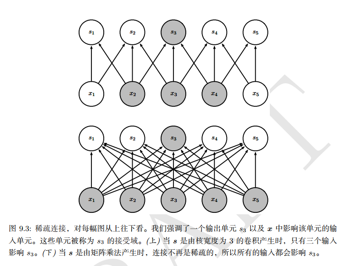

## 序言
### 卷积
* [《A guide to convolution arithmetic for deep learning》](paper/2018-A%20guide%20to%20convolution%20arithmetic%20for%20deep%20learning%20.pdf)


### what





* [A Beginner's Guide To Understanding Convolutional Neural Networks Part-3](https://adeshpande3.github.io/The-9-Deep-Learning-Papers-You-Need-To-Know-About.html)
    * 如果局部出现边缘特征，则该输出响应大 \
    
    * 因此反向传播可以分为4部分
        1. 前馈过程
        2. 损失函数
        3. 反向过程
        4. 权值更新

* [Understanding and coding Neural Networks From Scratch in Python and R](https://www.analyticsvidhya.com/blog/2017/05/neural-network-from-scratch-in-python-and-r/)
    * 你有两种方式学习和实践一个概念：
        1. 你可以学习整个理论,然后寻找使用这些概念的应用;这样，你需要学习整个算法如何工作，背后的数学，它的假设，
        限制然后使用它，鲁棒性很强，但是时间成本很大；
        2. 从一个简单的基本出发并且开发一个学科的基本认识，然后挑一个问题并开始解决它。
         在解决问题的过程中学习概念，一直更新和提升你的理解，因此你阅读如何使用一个算法，尝试不同的参数，值，限制来更新你对
         算法的理解了；

* [一文概览深度学习中的卷积结构](https://mp.weixin.qq.com/s?__biz=MzA3MzI4MjgzMw==&mid=2650731362&idx=4&sn=d163dd19d806f84928cacae8e92f5114&chksm=871b371cb06cbe0a738122035ff03c67eb4be20730722fd8a6f36e8b116b5501e1124bff02fe&scene=21#wechat_redirect)
* [卷积神经网络CNN（1）——图像卷积与反卷积（后卷积，转置卷积）](https://blog.csdn.net/fate_fjh/article/details/52882134)
    





   
    
### why

#### 特征（模式，激活的神经元，特征检测）

* 当当前输入的感受野中有特别的模式的时候， 神经元被激活
* 神经元检测模式可以通过（1）（2）（3）可视化：
    * 优化它的输入区域最大化神经元激活
    * 可视化梯度或者在输入像素上（bp）指导梯度的神经元
    * 在训练集上可视化一组激活神经元最大的图片区域，

### how

* 计算机调整过滤器值在训练期间，是通过反向传播。

### which


* [变形卷积核、可分离卷积？卷积神经网络中十大拍案叫绝的操作](https://zhuanlan.zhihu.com/p/28749411)
* [CNN中千奇百怪的卷积方式大汇总](https://zhuanlan.zhihu.com/p/29367273)





## 论文

### 时间空间复杂度

* [12.时间空间复杂度](12.时间空间复杂度.md)


### 《Deep learning and the information bottleneck principle》
* [paper](paper/2015-Deep%20learning%20and%20the%20information%20bottleneck%20principle.pdf)
* 基于重整化群理论，看不懂。
* the amountof information about target outputs diminishes during propagation, although the gradient does not vanish. 



## 后记


## 杂谈

### 如何学习：
* Start with simple basics and develop an intuition on the subject.
*  pick a problem and start solving it
* Learn the concepts while you are solving the problem. Keep tweaking and improving your understanding. 
* you read up how to apply an algorithm – go out and apply it. 
* Once you know how to apply it, try it around with different parameters, values, limits and develop an understanding of the algorithm.


## 一些疑问和解答：

### 1、CNN的卷积核是单层的还是多层的？
* [1、CNN的卷积核是单层的还是多层的？](https://www.julyedu.com/question/big/kp_id/26/ques_id/932)
    * 每个卷积核学习自己的特征， 也就是一种观察前一层输入的方式
    * 多个卷积核可以组合起来得到更好的对前一层输入的理解
    
* [卷积神经网络CNN总结](https://www.cnblogs.com/skyfsm/p/6790245.html)
    * 卷积神经网络是一种层级结构；
    * 一般CNN结构依次为
        1. `INPUT`
        2.	`[[CONV -> RELU]*N -> POOL?]*M` 
        3.	`[FC -> RELU]*K`
        4.	`FC`
    * 卷积神经网络之训练算法
        1.	同一般机器学习算法，先定义Loss function，衡量和实际结果之间差距。
        2.	找到最小化损失函数的W和b， CNN中用的算法是SGD（随机梯度下降）。
    * 卷积神经网络之优缺点
        * 优点
            * 共享卷积核，对高维数据处理无压力
            * 无需手动选取特征，训练好权重，即得特征分类效果好
        * 缺点
            * 需要调参，需要大样本量，训练最好要GPU
            * 物理含义不明确（也就说，我们并不知道没个卷积层到底提取到的是什么特征，而且神经网络本身就是一种难以解释的“黑箱模型”）

* [谈谈卷积神经网络](http://chenggang.me/2017/09/12/%E8%B0%88%E8%B0%88%E5%8D%B7%E7%A7%AF%E7%A5%9E%E7%BB%8F%E7%BD%91%E7%BB%9C/)
    * 如果将卷积核和图像中的对应区域沿任意方向都拉成一个向量的话，卷积运算其实就是向量的内积运算。
    而向量内积是衡量两个向量之间的相似性的，所以卷积核在图像某一区域的卷积结构实际上就是这个卷积核与图像该区域相似性的度量。
    * 卷积核除了权重矩阵一般还包含一个偏置，对应数据本身的倾向。

* [深度学习笔记](http://wangxin123.com/2019/01/01/%E6%B7%B1%E5%BA%A6%E5%AD%A6%E4%B9%A0%E7%AC%94%E8%AE%B0/#%E5%8D%B7%E7%A7%AF%E7%A5%9E%E7%BB%8F%E7%BD%91%E7%BB%9C%E7%A4%BA%E4%BE%8B)
    * 