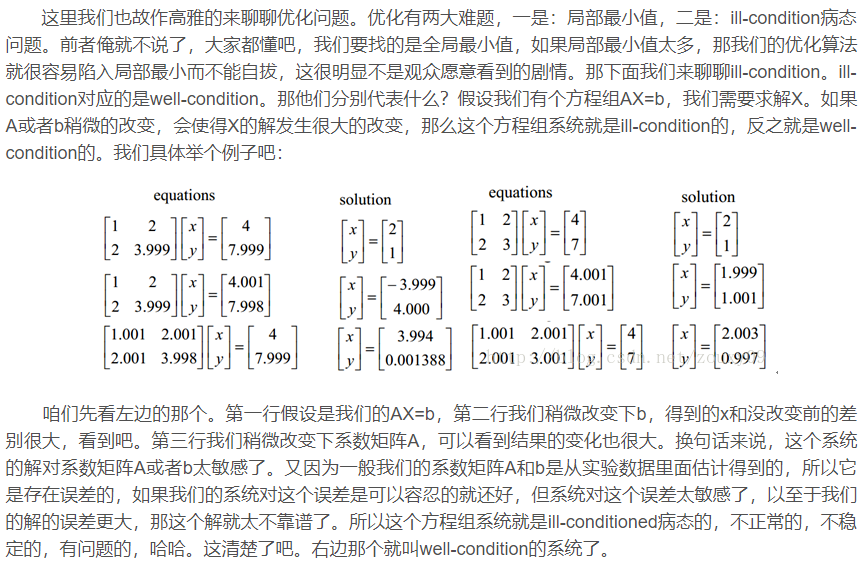
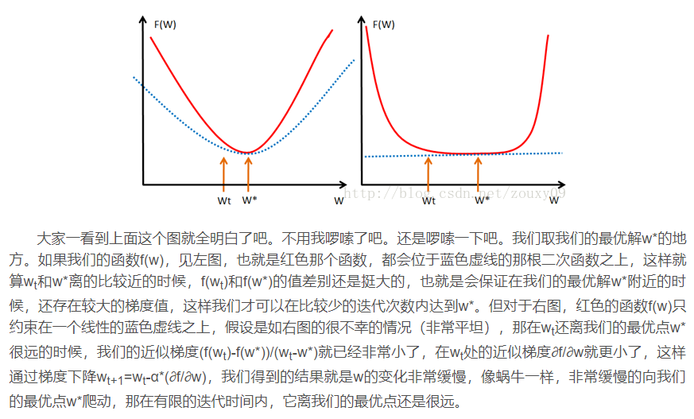

* [机器学习中的范数规则化之（一）L0、L1与L2范数](https://blog.csdn.net/zouxy09/article/details/24971995)
    * 最小化误差是为了让我们的模型拟合我们的训练数据，而规则化参数是防止我们的模型过分拟合我们的训练数据;
    * L0范数是指向量中非0的元素的个数。如果我们用L0范数来规则化一个参数矩阵W的话，就是希望W的大部分元素都是0。
    * L1范数是指向量中各个元素绝对值之和，
    * L2范数: ||W||2。它也不逊于L1范数，它有两个美称，在回归里面，有人把有它的回归叫“岭回归”（Ridge Regression），
    有人也叫它“权值衰减weight decay”; 
    * L2范数有助于处理 condition number不好的情况下矩阵求逆很困难的问题。\
    
    * 加入正则项对于函数曲线的影响： 左边是加入后的曲线，右边是加入前的曲线 \
    