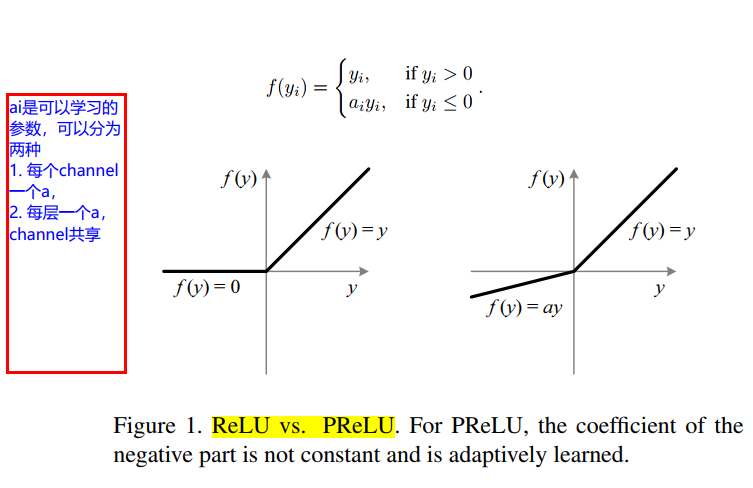
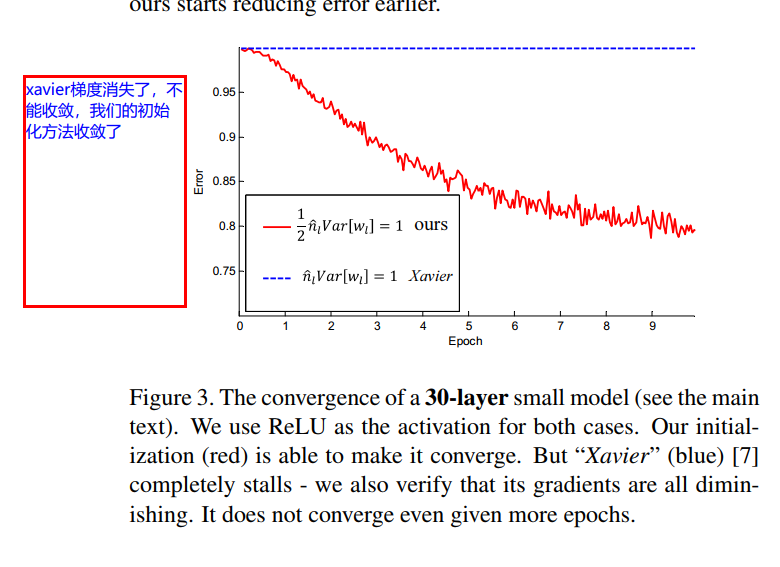

## 序言

* 权值初始化的方法主要有：常量初始化（constant）、高斯分布初始化（gaussian）、positive_unitball初始化、
均匀分布初始化（uniform）、xavier初始化、msra初始化、双线性初始化（bilinear）；

    
    
## 正文

### 《Understanding the difficulty of training deep feedforward neural networks.》
* [paper](paper/2010-Understanding%20the%20difficulty%20of%20training%20deep%20feedforward%20neural%20networks..pdf)
* Xavierc初始化
* 内容提要：
    * 这个导数基于假设：激活是线性的;
* [CNN的数值实验](https://zhuanlan.zhihu.com/p/22027076)
    * xavier+relu=0.9
    * gussian+relu=0.1
    * gussian+sigmoid=0.9
* [CNN数值——xavier](https://zhuanlan.zhihu.com/p/22028079)
    * ReLU的优势在与模型前向后向计算的过程中，它可以更好地传递数据，不会像sigmoid那样有梯度传递的问题，
    但是它又缺少了sigmoid的重要特性，那就是对数据的控制力。 \
    

### 《2015-Delving Deep into Rectifiers Surpassing Human-Level Performance on ImageNet Classification》
* [paper](paper/2015-Delving%20Deep%20into%20Rectifiers%20Surpassing%20Human-Level%20Performance%20on%20ImageNet%20Classification.pdf)
* He初始化
* 内容提要：
    * The central idea is to investigate the variance of the responses in each layer.\
    
    
    * 核心是探索了方差在层与层之间的传递关系。

## 后记

## 杂谈