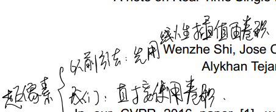
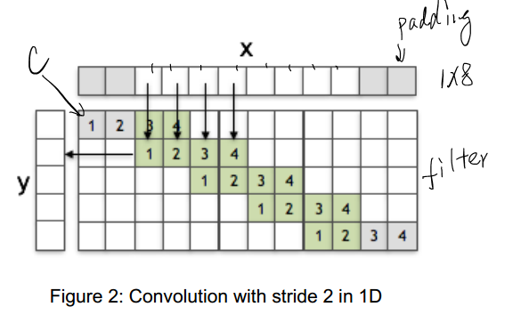
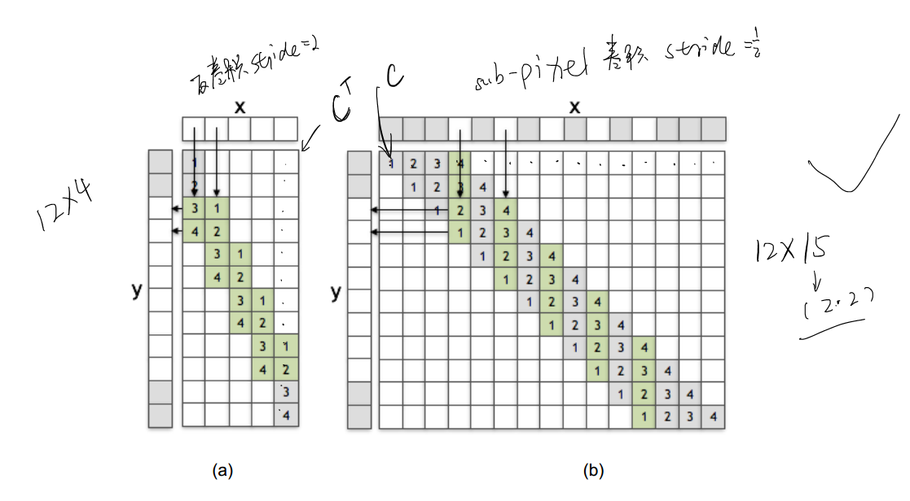
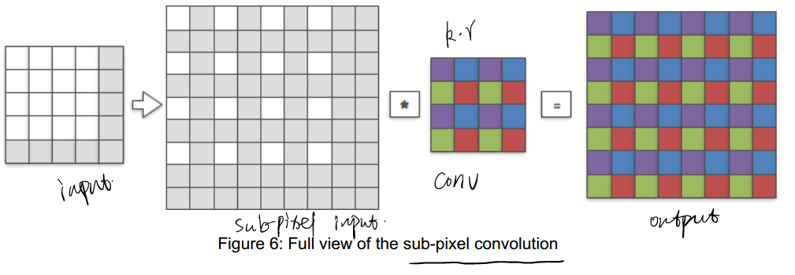

* [paper](paper/23.902-2016-Is-the-deconvolution-layer-the-same-as-a-convolutional-layer.pdf)

## what

* 以前需要上采样：

  * 反卷积
  * 插值+卷积

* 我们的方式

  * 使用卷积

* focus on two aspects related to two questions   

  * how can *r*2 channels magically become a HR image?   
  * why are convolution in LR space a better choice?   

  

## where

### 卷积与反卷积

* 卷积的矩阵

  

* 反卷积的两种方式

* 反卷积需要给中间插入很多0，这样低效
* 反卷积的图示：灰色为0，所以可以仔细查看，输入收到影响的区域为同色区域

* 反卷积的代替形式：可以不用内部插值，直接卷积不同核每次

  

* 如何拼接：we can simply use the periodic shuffling operation mentioned in our paper to reshape the output channels to the HR output.    

### 优点

* 特征图包含相同的信息
* 但是参数多了，算法表达能力强了

