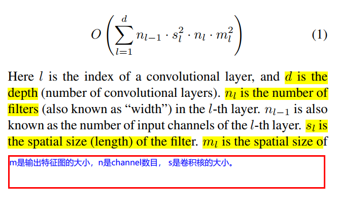
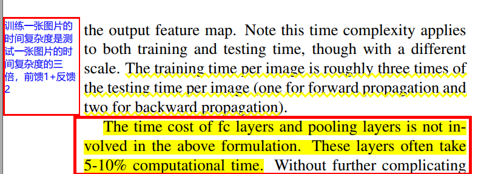
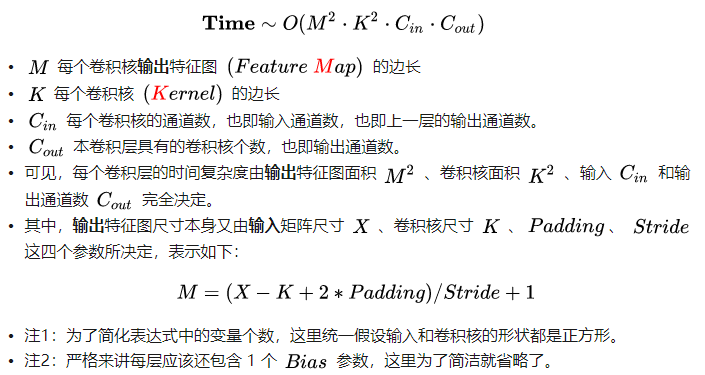

## 写在前面

* [深度学习中GPU和显存分析](https://zhuanlan.zhihu.com/p/31558973)
* [浅谈深度学习:如何计算模型以及中间变量的显存占用大小](https://cloud.tencent.com/developer/article/1145421?client=tim&ADUIN=303061833&ADSESSION=1531324706&ADTAG=CLIENT.QQ.5567_.0&ADPUBNO=26815)
* [卷积神经网络的压缩和加速](https://mp.weixin.qq.com/s/_kI-eMFKiL4pvDoXqqukBw)

## 时间复杂度

### 《Convolutional Neural Networks at Constrained Time Cost》
* [paper](paper/2014-Convolutional%20Neural%20Networks%20at%20Constrained%20Time%20Cost.pdf) 

* 时间复杂度的计算公式： \
 \

* 咋感觉2x2的卷积核比3x3的卷积核好，而且深度和宽度的折中也很重要。
* 延迟下采样： pool层步长为1， 后面卷积层步长不为1
* 卷积网络时间复杂度计算
    

## 空间复杂度

* 空间复杂度（访存量），严格来讲包括两部分：总参数量 + 各层输出特征图。
* 卷积网路空间复杂度

## 性能分析

* [性能分析](12.深度学习模型的性能分析.docx)
