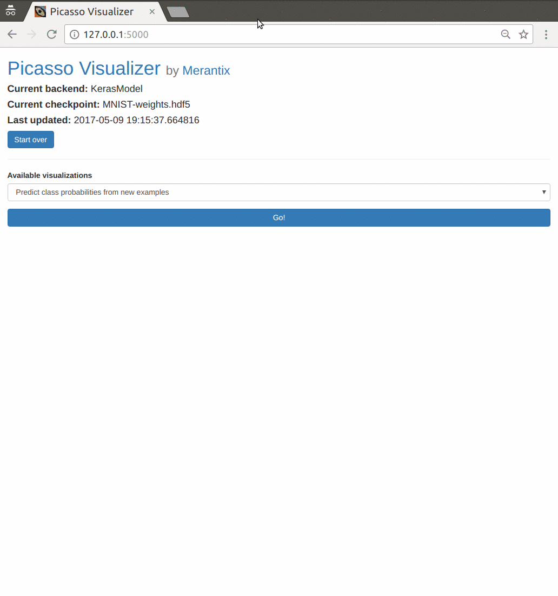
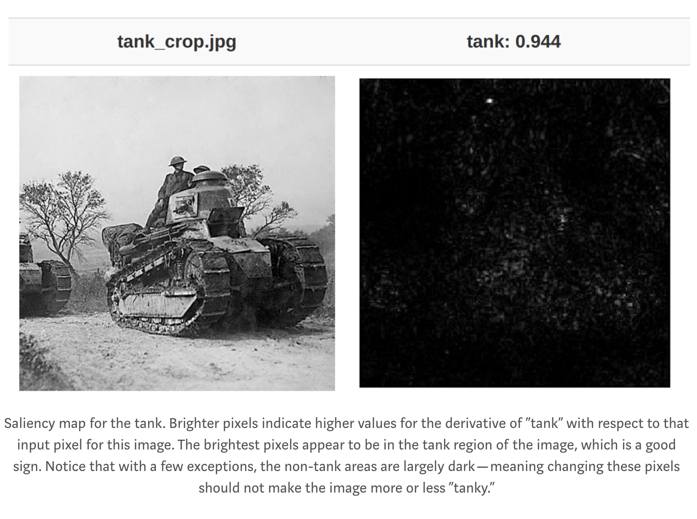
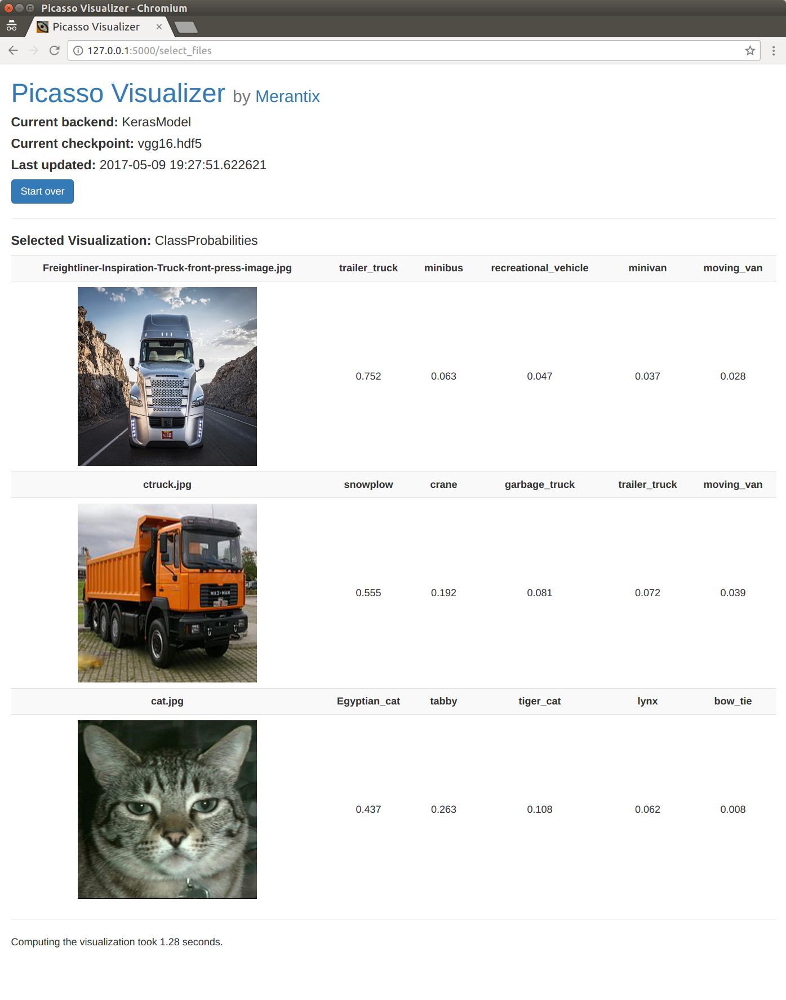
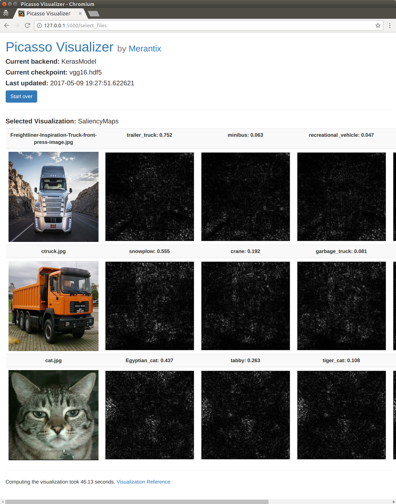

https://medium.com/merantix/picasso-a-free-open-source-visualizer-for-cnns-d8ed3a35cfc5

虽然定义和训练深度神经网络（DNN）比以往任何时候都容易，但理解学习过程仍然有些不透明。 在培训期间监控丢失或分类错误并不总是会阻止您的模型学习错误的东西或为您的预期分类任务学习代理。 要理解我们的意思，请考虑这个（可能是伪造的）故事[1]：

> 曾几何时，美国陆军想利用神经网络自动探测伪装的敌方坦克。研究人员在50张树上伪装坦克的照片上训练了神经网络，还有50张没有坦克的树木照片......
> 明智的是，研究人员最初拍摄了200张照片，100张坦克照片和100张树木照片。他们只使用了50个训练集。研究人员在剩下的100张照片上运行了神经网络，没有经过进一步的训练，神经网络正确分类了所有剩余的照片。成功证实了！研究人员将完成的工作交给了五角大楼，后者很快就将其交还，他们抱怨说，在他们自己的测试中，神经网络并没有比辨别照片的机会更好。
> 事实证明，在研究人员的数据集中，在阴天拍摄了伪装坦克的照片，而在晴天拍摄了平原森林的照片。神经网络已经学会区分阴天和晴天，而不是将伪装坦克与空森林区分开来。

* 无论这个故事的真实性如何，机器学习研究人员都很熟悉这一点：培训指标并不总能说明整个故事。 并且赌注比以往任何时候都高：对于像自动驾驶汽车这样的深度学习应用不断增加，这些训练错误可能是致命的[2]。

* 幸运的是，部分遮挡[3]和显着性图[4]等标准可视化提供了对学习过程的完整性检查。 存在用于标准神经网络可视化的工具包[5]以及用于监控训练过程的工具。 如果不是模型特定的话，它们通常与深度学习框架联系在一起。 用于生成标准可视化的通用，易于设置的工具是否可以使这些研究人员免于检测晴天而不是坦克？

### Picasso

* Picasso是一个免费的开源（Eclipse公共许可证）DNN可视化工具，可以为您提供部分遮挡和显着性映射，并且可以轻松实现。 在Merantix，我们使用各种神经网络架构; 我们开发了毕加索，以便在各种垂直行业中轻松查看我们模型的标准可视化：包括汽车应用，例如道路分割或物体检测失败时的理解; 广告，例如了解为什么某些广告素材获得更高的点击率; 和医学成像，例如分析CT或X射线图像中的哪些区域包含不规则性。

* Picasso是一个Flask应用程序，它将深度学习框架与一组默认和用户定义的可视化相结合。 您可以使用内置可视化并轻松添加自己的可视化。 Picasso开发用于检查点Keras和Tensorflow神经网络。 如果您想尝试但没有经过培训的模型，我们会为您提供Tensorflow和Keras MNIST检查点以及Keras VGG16检查点。

* 在Merantix，我们对卷积神经网络（CNN）特别感兴趣，它将图像作为输入并进行分类。 我们在考虑这些参数的情况下开发了毕加索。 但是，该框架足够灵活，可用于各种模型。 虽然所包含的可视化应该在不同的NN之间相当健壮，但如果您愿意，您仍然可以实现特定于模型的可视化。

* 我们提供一些开箱即用的标准可视化：
  * 部分遮挡遮挡图像的某些部分，并查看分类如何变化。
  * 显着性映射计算关于输入图像的类预测的衍生物。
  * 类预测本身不是可视化，但可以是对学习过程的简单，简单的检查。
  * 我们还有更多的工作！ 有关更深入的说明，请参阅我们关于arXiv的论文。

### Picasso in practice

* 让我们用Picasso的两个内置可视化攻击坦克问题：部分遮挡和显着性映射。 在这些示例中，我们将使用预先训练的VGG16模型进行分类。 我们已经知道这个模型非常擅长对坦克进行分类：我们可以使用这些可视化来检查模型是否实际上是基于坦克进行分类而不是天空？
* 通过顺序地阻挡部分图像，我们可以分辨哪些区域对分类更重要。 该图像通过VGG16模型分类，具有94％的分类概率“坦克”。图像的明亮部分对应于给定分类的较高概率。 例如，天空区域非常明亮，因为遮挡天空不会影响该图像被分类为坦克的概率。 相反，坦克胎面区域较暗，因为没有它们，模型很难知道它是否在看坦克。

* 我们可以看到这种可视化如何帮助陆军：很明显，当“坦克”部件缺失时（例如，坦克踏板），模型无法成功地对其进行分类。 有趣的是，当你阻挡一些胎面时，将图像分类为半轨的可能性更高。 这在直觉上是有道理的，因为半轨道在前面有规则的轮子。

* 除部分遮挡外，我们还提供开箱即用的显着性图。 显着图在分类方面查看输入图像的导数（通过反向传播）。 给定像素处的高值意味着更改此像素应该更显着地影响分类。

### Adding visualizations

* 我们希望它能够特别容易地集成新的可视化。 您需要做的就是将可视化代码放在可视化文件夹中，并制作一个HTML模板来显示它。

[See the tutorial on the ](https://picasso.readthedocs.io/en/latest/visualizations.html)`ClassProbabilites`[ visualization for an example on how to build very simple visualization.](https://picasso.readthedocs.io/en/latest/visualizations.html)

### Using your own Models

* Naturally, you’ll want to use the included visualizations with your own trained neural networks. [We’ve tried to make this as simple as possible,](https://picasso.readthedocs.io/en/latest/models.html) but at the minimum you’ll need to define three methods:
  1. `preprocess` tell the visualization how to change uploaded images into NN inputs
  2. `postprocess` tell the visualization how to change flattened intermediate layers to the image dimensions (this is needed by visualizations which operate on intermediate layers, like saliency maps)
  3. `decode_prob` tell the visualization how to interpret the raw output, usually an array of probabilities, by annotating with class names
* How to construct these functions is detailed in this tutorial. These functions can be specified separately from the source code for the app.

