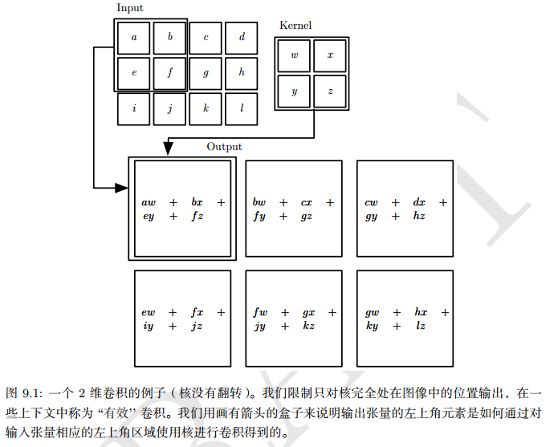

### 卷积运算


### 动机

* 卷积网络的三个重要思想：
    * 稀疏交互
    * 参数共享
    * 等变表示
* 通过稀疏交互
    * 核变小
    * 层与层之间，同一个输入影响的输出变少了
    





    
* 参数共享
    * 层与层之间，影响同一个输出的的输入变少了
    * 更深的网络，更大的感受野
        * 更深的网络的同一个输入，受更多最原始输入的影响     
* 等变表示
    * 输入改变，输出同样的方式改变
    
    
    
## important CNN concepts

### 特征（模式，激活的神经元，特征检测）

* 当当前输入的感受野中有特别的模式的时候， 神经元被激活
* 神经元检测模式可以通过（1）（2）（3）可视化：
    * 优化它的输入区域最大化神经元激活
    * 可视化梯度或者在输入像素上（bp）指导梯度的神经元
    * 在训练集上可视化一组激活神经元最大的图片区域，